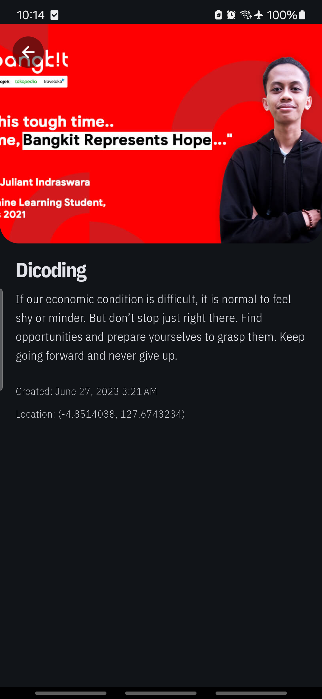

# 📰 News App

**News App** is a Flutter-based mobile application that allows users to view, post, and interact with stories from the Dicoding API. It includes secure user authentication, photo uploads using the device camera, and smooth navigation using declarative routing.

---

## 🚀 Features

### 🔐 Authentication
- Login and registration screens
- Password input with obscured text
- Session and token storage using `SharedPreferences`
- Persistent login (auto-login if token exists)
- Logout functionality to clear session and token

### 📚 Story List
- Fetch and display stories from the Dicoding API
- Shows user name and photo
- Tap on a story to view details with full description

### 📸 Add Story
- Add a new story with a short description
- Upload photos directly from the camera or gallery

### 🔄 Advanced Navigation
- Implements declarative navigation using `go_router`
- Navigation flow changes based on login status

---

## 🛠 Tech Stack

| Category          | Technology           |
|-------------------|----------------------|
| Language          | Dart                 |
| Framework         | Flutter              |
| State Management  | Provider             |
| Navigation        | go_router            |
| API Communication | http                 |
| Local Storage     | shared_preferences   |
| Media Access      | camera, image_picker |
| Utility Libraries | intl, image          |

---

## 📸 Screenshots

<table>
  <tr>
    <td align="center"><b>Home Screen</b></td>
    <td align="center"><b>Detail Screen</b></td>
  </tr>
  <tr>
    <td align="center">
      
    </td>
    <td align="center">
      
    </td>
  </tr>
</table>

---

## 📦 Getting Started

To run this project locally:

### 1. Clone the repository
Run the following command in your terminal:

`git clone https://github.com/AgungKusumma/news_app.git`  
Then navigate into the project folder:  
`cd news_app`

### 2. Install dependencies
Use this command to install all required packages:  
`flutter pub get`

### 3. Run the app
Make sure an emulator or device is connected, then run:  
`flutter run`

> ✅ Make sure you have Flutter SDK installed and set up properly.

---

## 📄 License

This project is open for educational and personal use.  
You are free to use, modify, and distribute this code as long as it is done fairly and responsibly.

If you'd like to connect or reach out, feel free to visit my LinkedIn — it's listed in my GitHub bio.